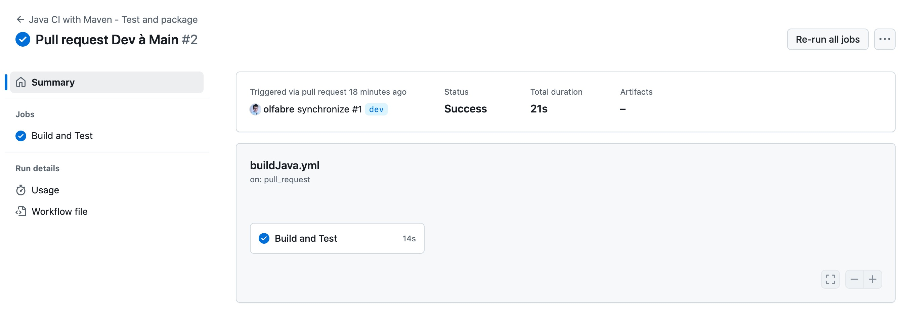
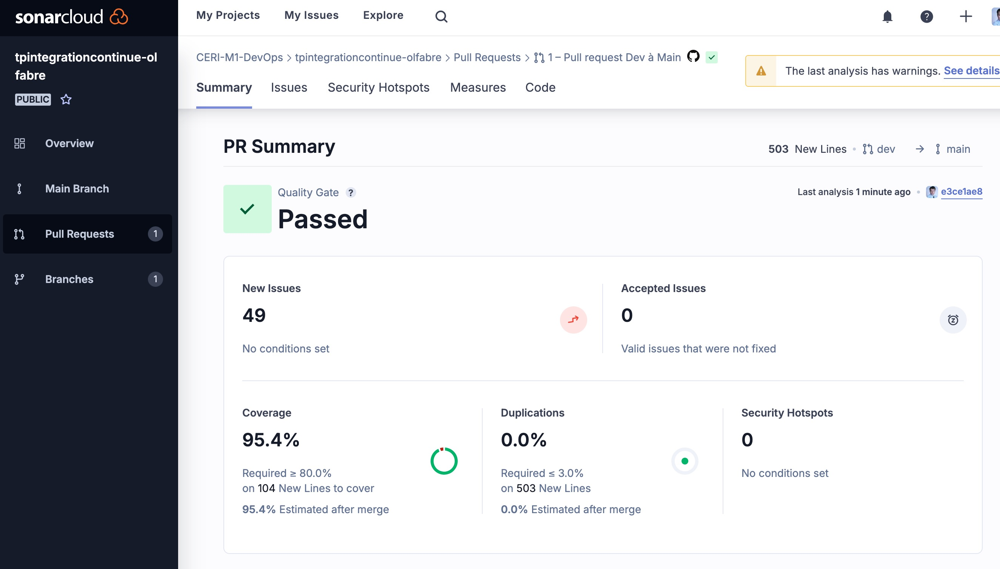
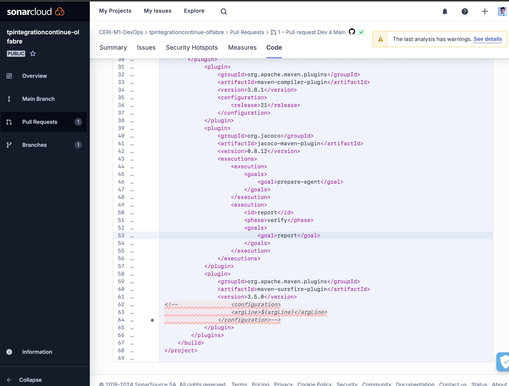

### Intégration Continue

#### Exercice1

Sur gitHub,   

- créer un dossier `.github`

- créer un sous dossier `workflows`

- créer un fichier salut.yml

Voici le contenu du fichier:

```yaml
name: Bonjour

on: [push] # Ce workflow se déclenche sur un push dans le dépôt

jobs:
 Salutations: # Nom du job : Salutations
  name: Salutations
  runs-on: ubuntu-latest # OS où s'exécute le job
  steps:
   - name: Hello #une tâche pour saluer
     env:
      personneASaluer: 'Mon voisin Totoro'
     run: echo "Bonjour ${personneASaluer}"
   - name: L'heure de salutation # affiche l'heure de la précédente tâche
     run: echo "L'heure était $(date)."

```

Respecter bien les indentations!

Explications:

```yaml
name: Bonjour
```

Cette ligne donne un nom au workflow dans GitHub Actions. Ici, le workflow s'appelle **"Bonjour"**.

```yaml
on: [push] # Ce workflow se déclenche sur un push dans le dépôt
```

La clé `on` spécifie les événements qui déclenchent l'exécution du workflow. Ici, le workflow se lance à chaque **push** dans le dépôt.

```yaml
jobs:
```

Cette clé contient tous les jobs (ou étapes) du workflow. Un workflow peut avoir plusieurs jobs, exécutés en parallèle ou en série selon les besoins.

```yaml
Salutations: # Nom du job : Salutations
```

Ce nom (`Salutations`) est un identifiant du job au sein du fichier YAML. Le nom peut être choisi librement, tant qu'il respecte les conventions YAML.

```yaml
 name: Salutations
```

Cette ligne donne un nom plus lisible au job, ici **"Salutations"**.

```yaml
runs-on: ubuntu-latest # OS où s'exécute le job
```

La clé `runs-on` spécifie l’environnement d'exécution du job. Ici, il s’exécute sur **`ubuntu-latest`**, qui est la dernière version d’Ubuntu disponible sur GitHub Actions.

```yaml
steps:
```

La clé `steps` définit les différentes étapes (ou tâches) que le job va exécuter. Chaque étape est exécutée dans l’ordre où elle est listée.

```yaml
 - name: Hello #une tâche pour saluer

```

Cette étape s’appelle **"Hello"** et son but est d’afficher un message de salutation.

```yaml
env:
personneASaluer: 'Mon voisin Totoro'
```

Cette sous-clé `env` définit des variables d'environnement pour l'étape en cours. Ici, une variable **`personneASaluer`** est définie avec la valeur **"Mon voisin Totoro"**.

```yaml
 run: echo "Bonjour ${personneASaluer}"
```

La commande `run` exécute une commande shell. Ici, elle affiche un message de salutation utilisant la variable `personneASaluer`, qui affiche : **"Bonjour Mon voisin Totoro"**.

```yaml
 - name: L'heure de salutation # affiche heure précédente tâche

```

Cette étape s’appelle **"L'heure de salutation"** et affiche l'heure actuelle.

```yaml
 run: echo "L'heure était $(date)."
```

Cette commande affiche l'heure au moment de l'exécution, utilisant `$(date)` pour obtenir l’heure actuelle (template literal)


Le fichier `salut.yml` est un workflow simple qui s'exécute après un `push` et affiche une salutation, suivie de l'heure exacte de l’exécution !

On peut désactiver le worflow dans Actions, cliquez sur le nom du workflow et sélectionner `Disable workflow`


---

#### Exercice 2

Nous devons sélectionner la branche `dev`
Il contien un code `pom.xml`qui est la configuration principale d'un'projet Maven, avec des sections pour les dépendances, les propriétés, et les plugins pour la compilation, les tests, l'intégration de qualité de code et la couverture de tests

```xml
<?xml version="1.0" encoding="UTF-8"?>
<project xmlns="http://maven.apache.org/POM/4.0.0" xmlns:xsi="http://www.w3.org/2001/XMLSchema-instance" xsi:schemaLocation="http://maven.apache.org/POM/4.0.0 http://maven.apache.org/xsd/maven-4.0.0.xsd">
    <modelVersion>4.0.0</modelVersion>

    <groupId>ceri</groupId>
    <artifactId>moduleListeSimple</artifactId>
    <version>1.0-SNAPSHOT</version>
    <properties>
        <maven.compiler.source>21</maven.compiler.source>
        <maven.compiler.target>21</maven.compiler.target>
        <project.build.sourceEncoding>UTF-8</project.build.sourceEncoding>
        <sonar.organization>ceri-m1-devops</sonar.organization>
        <sonar.host.url>https://sonarcloud.io</sonar.host.url>
    </properties>
    <dependencies>
        <dependency>
            <groupId>org.junit.jupiter</groupId>
            <artifactId>junit-jupiter</artifactId>
            <version>5.10.2</version>
            <scope>test</scope>
        </dependency>
    </dependencies>

    <build>
        <plugins>
	   <plugin>
                <groupId>org.sonarsource.scanner.maven</groupId>
                <artifactId>sonar-maven-plugin</artifactId>
                <version>4.0.0.4121</version>
  	   </plugin>
            <plugin>
                <groupId>org.apache.maven.plugins</groupId>
                <artifactId>maven-compiler-plugin</artifactId>
                <version>3.8.1</version>
                <configuration>
                    <release>21</release>
                </configuration>
            </plugin>
            <plugin>
                <groupId>org.jacoco</groupId>
                <artifactId>jacoco-maven-plugin</artifactId>
                <version>0.8.12</version>
                <executions>
                    <execution>
                        <goals>
                            <goal>prepare-agent</goal>
                        </goals>
                    </execution>
                    <execution>
                        <id>report</id>
                        <phase>verify</phase>
                        <goals>
                            <goal>report</goal>
                        </goals>
                    </execution>
                </executions>
            </plugin>
            <plugin>
                <groupId>org.apache.maven.plugins</groupId>
                <artifactId>maven-surefire-plugin</artifactId>
                <version>3.5.0</version>
<!--                <configuration>
                    <argLine>${argLine}</argLine>
                </configuration>-->
            </plugin>
        </plugins>
    </build>
</project>
```

#### Structure et Métadonnées de Projet

```xml
<project xmlns="http://maven.apache.org/POM/4.0.0" xmlns:xsi="http://www.w3.org/2001/XMLSchema-instance" xsi:schemaLocation="http://maven.apache.org/POM/4.0.0 http://maven.apache.org/xsd/maven-4.0.0.xsd">
    <modelVersion>4.0.0</modelVersion>
```

- **Déclaration des namespaces** : indique que le projet suit le modèle POM de Maven version 4.0.0.

```xml
    <groupId>ceri</groupId>
    <artifactId>moduleListeSimple</artifactId>
    <version>1.0-SNAPSHOT</version>
```

- **groupId** : identifie l'organisation ou l'auteur du projet, ici `"ceri"`.

- **artifactId** : le nom unique de l’artifact, ici `"moduleListeSimple"`.

- **version** : version du projet ; `"1.0-SNAPSHOT"` indique une version en cours de développement.


#### Propriétés

```xml
    <properties>
        <maven.compiler.source>21</maven.compiler.source>
        <maven.compiler.target>21</maven.compiler.target>
        <project.build.sourceEncoding>UTF-8</project.build.sourceEncoding>
        <sonar.organization>ceri-m1-devops</sonar.organization>
        <sonar.host.url>https://sonarcloud.io</sonar.host.url>
    </properties>
```


- **Version Java** : `<maven.compiler.source>` et `<maven.compiler.target>` spécifient la version de Java à utiliser, ici Java 21.

- **Encodage** : `<project.build.sourceEncoding>` indique que le projet utilise l’encodage UTF-8.

- **Configuration Sonar** : les propriétés **`sonar.organization`** et **`sonar.host.url`** configurent l'organisation et l'URL de SonarCloud pour l'analyse de la qualité du code.


#### Dépendances

```xml
<dependencies>
        <dependency>
            <groupId>org.junit.jupiter</groupId>
            <artifactId>junit-jupiter</artifactId>
            <version>5.10.2</version>
            <scope>test</scope>
        </dependency>
    </dependencies>
```

- **JUnit** : la dépendance `junit-jupiter` version 5.10.2 est ajoutée pour écrire et exécuter des tests unitaires. Le `scope` de cette dépendance est défini sur `"test"`, donc elle sera utilisée uniquement pendant la phase de test


#### Configuration de Build et Plugins

```xml
<build>
        <plugins>
```

- **Plugins Maven** : cette section configure les plugins Maven utilisés pour différentes tâches comme la compilation, les tests et l'analyse de couverture.


##### Plugin Sonar

```xml
	   <plugin>
                <groupId>org.sonarsource.scanner.maven</groupId>
                <artifactId>sonar-maven-plugin</artifactId>
                <version>4.0.0.4121</version>
  	   </plugin>
```


- **`sonar-maven-plugin`** : configure le plugin Sonar pour l'intégration avec SonarCloud. Cela permet de générer des rapports de qualité de code à chaque build. 

  

##### Plugin de Compilation

```xml
            <plugin>
                <groupId>org.apache.maven.plugins</groupId>
                <artifactId>maven-compiler-plugin</artifactId>
                <version>3.8.1</version>
                <configuration>
                    <release>21</release>
                </configuration>
            </plugin>
```

- **`maven-compiler-plugin`** : ce plugin compile le code source Java. La version Java est spécifiée avec `<release>21</release>`, donc Java 21 sera utilisé.

##### Plugin JaCoCo

```xml
            <plugin>
                <groupId>org.jacoco</groupId>
                <artifactId>jacoco-maven-plugin</artifactId>
                <version>0.8.12</version>
                <executions>
                    <execution>
                        <goals>
                            <goal>prepare-agent</goal>
                        </goals>
                    </execution>
                    <execution>
                        <id>report</id>
                        <phase>verify</phase>
                        <goals>
                            <goal>report</goal>
                        </goals>
                    </execution>
                </executions>
            </plugin>
```


- **`jacoco-maven-plugin`** : ce plugin est utilisé pour mesurer la couverture des tests.
  - L'exécution `prepare-agent` initialise l’agent JaCoCo pendant la phase de test.
  - L'exécution `report` génère un rapport de couverture pendant la phase `verify`.


##### Plugin Surefire

```xml
            <plugin>
                <groupId>org.apache.maven.plugins</groupId>
                <artifactId>maven-surefire-plugin</artifactId>
                <version>3.5.0</version>
<!--                <configuration>
                    <argLine>${argLine}</argLine>
                </configuration>-->
            </plugin>
        </plugins>
    </build>
```

- **`maven-surefire-plugin`** : ce plugin exécute les tests JUnit. La section de configuration commentée (balises `<!-- ... -->`) peut être utilisée pour ajouter des arguments spécifiques lors de l'exécution des tests.


Le fichier `pom.xml` est bien structuré pour un projet Java avec les éléments essentiels pour la compilation, l'analyse de la qualité de code avec Sonar, la couverture de test avec JaCoCo, et les tests avec JUnit. Les versions et les configurations choisies sont récentes et adaptées à un projet Java moderne utilisant Maven.


#### Exercice 2

On se branche sur `dev`

On créer un dossier `.github`

On créer un dossier `workflows`

on va créer le fichier `buildJava.yml` pour configurer le workflow GitHub Actions en fonction des instructions données:

- Le nom du workflow sera "Java CI with Maven - Test and package"
- déclencher lorsqu’on émet une pull request sur la branche main.
- Il ne contient qu’un seul job
- s’exécute sur la dernière version d’ubuntu. 


Il y aura 3 étapes:

- utilisez l’action actions/checkout@v4 pour se placer dans le dépôt courant (vous pouvez consulter https://github.com/actions/checkout) 

- utilisez ensuite l’action actions/setup-java@v4 (vous pouvez consulter https://github.com/actions/setup-java). Choisissez la version 21 et la distribution corretto 
- enfin faire construire votre package avec maven : pour cela un fichier pom.xml vous est fourni, qui définit les dépendances impliquées dans ce projet. La commande pour construire est mvn –B package, elle lancera les tests avec JUnit.


==buildJava.yml==

```yaml
name: Java CI with Maven - Test and package

# Déclenchement du workflow: ce workflow s’exécute à chaque pull request vers la branche main.
on:
  pull_request:
    branches:
      - main

jobs:
  build:
    # Job "build": ce job s’exécute sur la dernière version d'Ubuntu (ubuntu-latest).
    name: Build and Test
    runs-on: ubuntu-latest

    # Etapes
    steps:

      # Checkout code: utilise l’action actions/checkout@v4 pour cloner le dépôt actuel et accéder aux fichiers.
      - name: Checkout code V4
        uses: actions/checkout@v4

      # Setup Java: utilise l’action actions/setup-java@v4 pour configurer l’environnement Java. Nous spécifions la version 21 avec la distribution corretto.
      - name: Set up Java V4
        uses: actions/setup-java@v4
        with:
          java-version: '21'
          distribution: 'corretto'


      # Build and test with Maven: exécute la commande mvn -B package pour compiler le projet, exécuter les tests JUnit et construire le package en fonction des configurations du fichier pom.xml
      - name: Build and test with Maven
        run: mvn -B package
```


voici le code sans le commentaire

```yaml
name: Java CI with Maven - Test and package

on:
  pull_request:
    branches:
      - main

jobs:
  build:
    name: Build and Test
    runs-on: ubuntu-latest

    steps:
      - name: Checkout code
        uses: actions/checkout@v4

      - name: Set up Java
        uses: actions/setup-java@v4
        with:
          java-version: '21'
          distribution: 'corretto'

      - name: Build and test with Maven
        run: mvn -B package

```


lors d'un `new pull-request `l'action Java CI with Maven - Test and package  s'exécute




#### Exercice 3 – Qualité du code

Nous allons observer la qualité de noter code en utilisant la plateforme https://sonarcloud.io (inscription avec mon gitHub)

et le rapport est sur https://sonarcloud.io/project/configuration?id=CERI-M1-DevOps_tpintegrationcontinue-olfabre


Pour pouvoir lancer l’analyse de la qualité, il faut changer la commande maven pour:

```yaml
mvn -B verify org.sonarsource.scanner.maven:sonar-maven-plugin:sonar
-Dsonar.projectKey=$(echo ${{ github.repository }} | sed 's-/-_-')
```

Pour intégrer SonarCloud dans votre workflow GitHub Actions et exécuter l’analyse de la qualité de votre code, vous devrez modifier la commande Maven et configurer le jeton d'authentification (`SONAR_TOKEN`). Voici comment procéder pour que la configuration respecte les nouvelles spécifications.


modification du fichier ==buildJava.yml==

```yaml
name: Java CI with Maven - Test and package

on:
  pull_request:
    branches:
      - main

jobs:
  build:
    name: Build and Test
    runs-on: ubuntu-latest

    steps:
      - name: Checkout code
        uses: actions/checkout@v4

      - name: Set up Java
        uses: actions/setup-java@v4
        with:
          java-version: '21'
          distribution: 'corretto'

      - name: Build, test, and analyze with Maven and SonarCloud
        env:
          SONAR_TOKEN: ${{ secrets.SONAR_TOKEN }}
        run: mvn -B verify org.sonarsource.scanner.maven:sonar-maven-plugin:sonar -Dsonar.projectKey=$(echo ${{ github.repository }} | sed 's-/-_-')

```





on modifie les fichiers et les codes de façon à obtenir 100%




Question 4:

Voici le fichier modifié

```yaml
name: Java CI with Maven - Test and package

on:
  pull_request:
    branches:
      - main

jobs:
  build:
    name: Build and Test
    runs-on: ubuntu-latest

    steps:
      - name: Checkout code
        uses: actions/checkout@v4

      - name: Set up Java
        uses: actions/setup-java@v4
        with:
          java-version: '21'
          distribution: 'corretto'

      - name: Cache Maven dependencies
        uses: actions/cache@v4
        with:
          path: ~/.m2/repository
          key: ${{ runner.os }}-maven-${{ hashFiles('**/*.xml') }}
          restore-keys: |
            ${{ runner.os }}-maven-
            
      - name: Cache SonarQube packages
        uses: actions/cache@v1
        with:
          path: ~/.sonar/cache
          key: ${{ runner.os }}-sonar
          restore-keys: ${{ runner.os }}-sonar

            
      - name: Build, test, and analyze with Maven and SonarCloud
        env:
          SONAR_TOKEN: ${{ secrets.SONAR_TOKEN }}
        run: mvn -B verify org.sonarsource.scanner.maven:sonar-maven-plugin:sonar -Dsonar.projectKey=$(echo ${{ github.repository }} | sed 's-/-_-')


```


### Explication des modifications :

1. **Étape "Cache Maven dependencies"** :
   - Cette étape utilise l'action `actions/cache@v4` pour mettre en cache le répertoire des dépendances Maven (`~/.m2/repository`), ce qui permet d'éviter de télécharger à chaque build les mêmes dépendances.
   - La clé de cache est basée sur un hachage des fichiers `.xml` (comme `pom.xml`), ce qui permet de créer un nouveau cache chaque fois que ces fichiers changent.
   - Le paramètre `restore-keys` permet d'utiliser un cache existant s'il existe, même si la clé exacte ne correspond pas.
2. **Autres étapes inchangées** :
   - Vous continuez à configurer Java avec `actions/setup-java@v4` et à exécuter votre build Maven avec SonarCloud comme avant.

Avec cette configuration, à chaque nouveau build, les dépendances Maven seront récupérées depuis le cache si elles sont déjà présentes, ce qui accélérera le processus de build en évitant les téléchargements redondants.


Question 5 

Dans un premier temps, je documente quelques fonctions du fichier ListeSimple.java

```java
package liste;

public class ListeSimple {
    private long size;
    Noeud tete;

    /**
     * Retourne la taille de la liste.
     * @return Le nombre de nœuds dans la liste.
     */
    public long getSize() {
        return size;
    }

    /**
     * Ajoute un nouvel élément en tête de la liste.
     * @param element L'élément à ajouter en tête de la liste.
     */
    public void ajout(int element) {
        tete = new Noeud(element, tete);
        size++;
    }

    /**
     * Modifie la première occurrence d'un élément avec une nouvelle valeur.
     * @param element L'élément à rechercher dans la liste.
     * @param nouvelleValeur La nouvelle valeur pour remplacer l'élément trouvé.
     */
    public void modifiePremier(Object element, Object nouvelleValeur) {
        Noeud courant = tete;
        while (courant != null && courant.getElement() != element)
            courant = courant.getSuivant();
        if (courant != null)
            courant.setElement(nouvelleValeur);
    }

    /**
     * Modifie toutes les occurrences d'un élément avec une nouvelle valeur.
     * @param element L'élément à rechercher dans la liste.
     * @param nouvelleValeur La nouvelle valeur pour remplacer chaque occurrence de l'élément trouvé.
     */
    public void modifieTous(Object element, Object nouvelleValeur) {
        Noeud courant = tete;
        while (courant != null) {
            if (courant.getElement() == element)
                courant.setElement(nouvelleValeur);
            courant = courant.getSuivant();
        }
    }

    /**
     * Retourne une représentation en chaîne de la liste.
     * @return Une chaîne représentant la liste.
     */
    public String toString() {
        StringBuilder sb = new StringBuilder("ListeSimple(");
        Noeud n = tete;
        while (n != null) {
            sb.append(n);
            n = n.getSuivant();
            if (n != null)
                sb.append(", ");
        }
        sb.append(")");
        return sb.toString();
    }

    /**
     * Supprime la première occurrence d'un élément dans la liste.
     * @param element L'élément à supprimer de la liste.
     */
    public void supprimePremier(Object element) {
        if (tete != null) {
            if (tete.getElement() == element) {
                tete = tete.getSuivant();
                size--;
                return;
            }
            Noeud precedent = tete;
            Noeud courant = tete.getSuivant();
            while (courant != null && courant.getElement() != element) {
                precedent = precedent.getSuivant();
                courant = courant.getSuivant();
            }
            if (courant != null) {
                precedent.setSuivant(courant.getSuivant());
                size--;
            }
        }
    }

    /**
     * Supprime toutes les occurrences d'un élément dans la liste.
     * @param element L'élément à supprimer de la liste.
     */
    public void supprimeTous(int element) {
        tete = supprimeTousRecurs(element, tete);
    }

    /**
     * Supprime récursivement toutes les occurrences d'un élément dans la sous-liste à partir d'un nœud donné.
     * @param element L'élément à supprimer de la sous-liste.
     * @param tete La tête de la sous-liste.
     * @return La nouvelle tête de la sous-liste après suppression des occurrences.
     */
    public Noeud supprimeTousRecurs(Object element, Noeud tete) {
        if (tete != null) {
            Noeud suiteListe = supprimeTousRecurs(element, tete.getSuivant());
            if (tete.getElement() == element) {
                size--;
                return suiteListe;
            } else {
                tete.setSuivant(suiteListe);
                return tete;
            }
        } else return null;
    }

    /**
     * Retourne l'avant-dernier nœud de la liste.
     * @return Le nœud avant le dernier dans la liste, ou null si la liste est trop courte.
     */
    public Noeud getAvantDernier() {
        if (tete == null || tete.getSuivant() == null)
            return null;
        else {
            Noeud courant = tete;
            Noeud suivant = courant.getSuivant();
            while (suivant.getSuivant() != null) {
                courant = suivant;
                suivant = suivant.getSuivant();
            }
            return courant;
        }
    }

    /**
     * Inverse l'ordre des nœuds dans la liste.
     */
    public void inverser() {
        Noeud precedent = null;
        Noeud courant = tete;
        while (courant != null) {
            Noeud next = courant.getSuivant();
            courant.setSuivant(precedent);
            precedent = courant;
            courant = next;
        }
        tete = precedent;
    }

    /**
     * Retourne le nœud précédent d'un nœud donné.
     * @param r Le nœud dont on souhaite obtenir le précédent.
     * @return Le nœud précédent, ou null si le nœud est la tête de la liste.
     */
    public Noeud getPrecedent(Noeud r) {
        Noeud precedent = tete;
        Noeud courant = precedent.getSuivant();
        while (courant != r) {
            precedent = courant;
            courant = courant.getSuivant();
        }
        return precedent;
    }

    /**
     * Échange deux nœuds donnés dans la liste.
     * @param r1 Le premier nœud à échanger.
     * @param r2 Le second nœud à échanger.
     */
    public void echanger(Noeud r1, Noeud r2) {
        if (r1 == r2)
            return;
        Noeud precedentR1;
        Noeud precedentR2;
        if (r1 != tete && r2 != tete) {
            precedentR1 = getPrecedent(r1);
            precedentR2 = getPrecedent(r2);
            precedentR1.setSuivant(r2);
            precedentR2.setSuivant(r1);
        } else if (r1 == tete) {
            precedentR2 = getPrecedent(r2);
            precedentR2.setSuivant(tete);
            tete = r2;
        }
        else  {
            precedentR1 = getPrecedent(r1);
            precedentR1.setSuivant(tete);
            tete = r1;
        }
        Noeud temp = r2.getSuivant();
        r2.setSuivant(r1.getSuivant());
        r1.setSuivant(temp);
    }
}

```

Ensuite, je désactive `buildJava.yml` sur gitHub.

On créé documentation.yml

```yaml
name: Documentation

on:
  pull_request:
    types: [closed]
    branches:
      - main

jobs:
  generate-docs:
    if: github.event.pull_request.merged == true
    runs-on: ubuntu-latest
    
    steps:
      - name: Checkout repository
        uses: actions/checkout@v2

      - name: Set up JDK
        uses: actions/setup-java@v2
        with:
          distribution: 'temurin'
          java-version: '11'

      - name: Generate Javadoc
        run: mvn -B javadoc:javadoc

      - name: Deploy to GitHub Pages
        uses: peaceiris/actions-gh-pages@v4
        with:
          github_token: ${{ secrets.GITHUB_TOKEN }}
          publish_dir: ./target/site/apidocs

```


on va le faire sur un commit et non un close request-merge pour la praticité du tp

```yaml
name: Generate and Deploy Documentation
permissions:
  contents: write
on:
  push:
    branches:
      - dev

jobs:
  generate-doc:
    runs-on: ubuntu-latest
    steps:
      - name: Checkout code
        uses: actions/checkout@v2

      - name: Set up JDK
        uses: actions/setup-java@v2
        with:
          distribution: 'temurin'
          java-version: '21'

      - name: Generate Javadoc
        run: mvn -B javadoc:javadoc

      - name: Deploy to GitHub Pages
        uses: peaceiris/actions-gh-pages@v4
        with:
          github_token: ${{ secrets.GITHUB_TOKEN }}
          publish_dir: ./target/reports/apidocs

```


la doc est générée dans la branche `gh-pages`

pour obtenir une page à l'adresse https://ceri-m1-devops.github.io/tpintegrationcontinue-olfabre/


on va sur la branche gh-pages, ensuite on va dans settings / pages / 

Dans Buid and déployment / source / Deploy from a branch

Dans Branch, je choisie gh-pages et root et SAVE


Fin du TP

