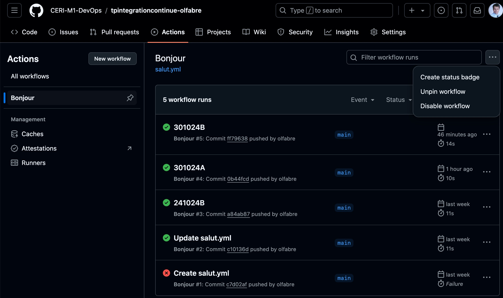

### Intégration Continue

#### Exercice1

Sur gitHub,   

- créer un dossier `.github`

- créer un sous dossier `workflows`

- créer un fichier salut.yml

Voici le contenu du fichier:

```yaml
name: Bonjour

on: [push] # Ce workflow se déclenche sur un push dans le dépôt

jobs:
 Salutations: # Nom du job : Salutations
  name: Salutations
  runs-on: ubuntu-latest # OS où s'exécute le job
  steps:
   - name: Hello #une tâche pour saluer
     env:
      personneASaluer: 'Mon voisin Totoro'
     run: echo "Bonjour ${personneASaluer}"
   - name: L'heure de salutation # affiche l'heure de la précédente tâche
     run: echo "L'heure était $(date)."

```

Respecter bien les indentations!

Explications:

```yaml
name: Bonjour
```

Cette ligne donne un nom au workflow dans GitHub Actions. Ici, le workflow s'appelle **"Bonjour"**.

```yaml
on: [push] # Ce workflow se déclenche sur un push dans le dépôt
```

La clé `on` spécifie les événements qui déclenchent l'exécution du workflow. Ici, le workflow se lance à chaque **push** dans le dépôt.

```yaml
jobs:
```

Cette clé contient tous les jobs (ou étapes) du workflow. Un workflow peut avoir plusieurs jobs, exécutés en parallèle ou en série selon les besoins.

```yaml
Salutations: # Nom du job : Salutations
```

Ce nom (`Salutations`) est un identifiant du job au sein du fichier YAML. Le nom peut être choisi librement, tant qu'il respecte les conventions YAML.

```yaml
 name: Salutations
```

Cette ligne donne un nom plus lisible au job, ici **"Salutations"**.

```yaml
runs-on: ubuntu-latest # OS où s'exécute le job
```

La clé `runs-on` spécifie l’environnement d'exécution du job. Ici, il s’exécute sur **`ubuntu-latest`**, qui est la dernière version d’Ubuntu disponible sur GitHub Actions.

```yaml
steps:
```

La clé `steps` définit les différentes étapes (ou tâches) que le job va exécuter. Chaque étape est exécutée dans l’ordre où elle est listée.

```yaml
 - name: Hello #une tâche pour saluer

```

Cette étape s’appelle **"Hello"** et son but est d’afficher un message de salutation.

```yaml
env:
personneASaluer: 'Mon voisin Totoro'
```

Cette sous-clé `env` définit des variables d'environnement pour l'étape en cours. Ici, une variable **`personneASaluer`** est définie avec la valeur **"Mon voisin Totoro"**.

```yaml
 run: echo "Bonjour ${personneASaluer}"
```

La commande `run` exécute une commande shell. Ici, elle affiche un message de salutation utilisant la variable `personneASaluer`, qui affiche : **"Bonjour Mon voisin Totoro"**.

```yaml
 - name: L'heure de salutation # affiche heure précédente tâche

```

Cette étape s’appelle **"L'heure de salutation"** et affiche l'heure actuelle.

```yaml
 run: echo "L'heure était $(date)."
```

Cette commande affiche l'heure au moment de l'exécution, utilisant `$(date)` pour obtenir l’heure actuelle (template literal)


Le fichier `salut.yml` est un workflow simple qui s'exécute après un `push` et affiche une salutation, suivie de l'heure exacte de l’exécution !

On peut désactiver le worflow dans Actions, cliquez sur le nom du workflow et sélectionner `Disable workflow`




---

#### Exercice 2

Nous devons sélectionner la branche `dev`
Il contien un code `pom.xml`qui est la configuration principale d'un'projet Maven, avec des sections pour les dépendances, les propriétés, et les plugins pour la compilation, les tests, l'intégration de qualité de code et la couverture de tests

```xml
<?xml version="1.0" encoding="UTF-8"?>
<project xmlns="http://maven.apache.org/POM/4.0.0" xmlns:xsi="http://www.w3.org/2001/XMLSchema-instance" xsi:schemaLocation="http://maven.apache.org/POM/4.0.0 http://maven.apache.org/xsd/maven-4.0.0.xsd">
    <modelVersion>4.0.0</modelVersion>

    <groupId>ceri</groupId>
    <artifactId>moduleListeSimple</artifactId>
    <version>1.0-SNAPSHOT</version>
    <properties>
        <maven.compiler.source>21</maven.compiler.source>
        <maven.compiler.target>21</maven.compiler.target>
        <project.build.sourceEncoding>UTF-8</project.build.sourceEncoding>
        <sonar.organization>ceri-m1-devops</sonar.organization>
        <sonar.host.url>https://sonarcloud.io</sonar.host.url>
    </properties>
    <dependencies>
        <dependency>
            <groupId>org.junit.jupiter</groupId>
            <artifactId>junit-jupiter</artifactId>
            <version>5.10.2</version>
            <scope>test</scope>
        </dependency>
    </dependencies>

    <build>
        <plugins>
	   <plugin>
                <groupId>org.sonarsource.scanner.maven</groupId>
                <artifactId>sonar-maven-plugin</artifactId>
                <version>4.0.0.4121</version>
  	   </plugin>
            <plugin>
                <groupId>org.apache.maven.plugins</groupId>
                <artifactId>maven-compiler-plugin</artifactId>
                <version>3.8.1</version>
                <configuration>
                    <release>21</release>
                </configuration>
            </plugin>
            <plugin>
                <groupId>org.jacoco</groupId>
                <artifactId>jacoco-maven-plugin</artifactId>
                <version>0.8.12</version>
                <executions>
                    <execution>
                        <goals>
                            <goal>prepare-agent</goal>
                        </goals>
                    </execution>
                    <execution>
                        <id>report</id>
                        <phase>verify</phase>
                        <goals>
                            <goal>report</goal>
                        </goals>
                    </execution>
                </executions>
            </plugin>
            <plugin>
                <groupId>org.apache.maven.plugins</groupId>
                <artifactId>maven-surefire-plugin</artifactId>
                <version>3.5.0</version>
<!--                <configuration>
                    <argLine>${argLine}</argLine>
                </configuration>-->
            </plugin>
        </plugins>
    </build>
</project>
```

#### Structure et Métadonnées de Projet

```xml
<project xmlns="http://maven.apache.org/POM/4.0.0" xmlns:xsi="http://www.w3.org/2001/XMLSchema-instance" xsi:schemaLocation="http://maven.apache.org/POM/4.0.0 http://maven.apache.org/xsd/maven-4.0.0.xsd">
    <modelVersion>4.0.0</modelVersion>
```

- **Déclaration des namespaces** : indique que le projet suit le modèle POM de Maven version 4.0.0.

```xml
    <groupId>ceri</groupId>
    <artifactId>moduleListeSimple</artifactId>
    <version>1.0-SNAPSHOT</version>
```

- **groupId** : identifie l'organisation ou l'auteur du projet, ici `"ceri"`.

- **artifactId** : le nom unique de l’artifact, ici `"moduleListeSimple"`.

- **version** : version du projet ; `"1.0-SNAPSHOT"` indique une version en cours de développement.


#### Propriétés

```xml
    <properties>
        <maven.compiler.source>21</maven.compiler.source>
        <maven.compiler.target>21</maven.compiler.target>
        <project.build.sourceEncoding>UTF-8</project.build.sourceEncoding>
        <sonar.organization>ceri-m1-devops</sonar.organization>
        <sonar.host.url>https://sonarcloud.io</sonar.host.url>
    </properties>
```


- **Version Java** : `<maven.compiler.source>` et `<maven.compiler.target>` spécifient la version de Java à utiliser, ici Java 21.

- **Encodage** : `<project.build.sourceEncoding>` indique que le projet utilise l’encodage UTF-8.

- **Configuration Sonar** : les propriétés **`sonar.organization`** et **`sonar.host.url`** configurent l'organisation et l'URL de SonarCloud pour l'analyse de la qualité du code.


#### Dépendances

```xml
<dependencies>
        <dependency>
            <groupId>org.junit.jupiter</groupId>
            <artifactId>junit-jupiter</artifactId>
            <version>5.10.2</version>
            <scope>test</scope>
        </dependency>
    </dependencies>
```

- **JUnit** : la dépendance `junit-jupiter` version 5.10.2 est ajoutée pour écrire et exécuter des tests unitaires. Le `scope` de cette dépendance est défini sur `"test"`, donc elle sera utilisée uniquement pendant la phase de test


#### Configuration de Build et Plugins

```xml
<build>
        <plugins>
```

- **Plugins Maven** : cette section configure les plugins Maven utilisés pour différentes tâches comme la compilation, les tests et l'analyse de couverture.


##### Plugin Sonar

```xml
	   <plugin>
                <groupId>org.sonarsource.scanner.maven</groupId>
                <artifactId>sonar-maven-plugin</artifactId>
                <version>4.0.0.4121</version>
  	   </plugin>
```


- **`sonar-maven-plugin`** : configure le plugin Sonar pour l'intégration avec SonarCloud. Cela permet de générer des rapports de qualité de code à chaque build. 

  

##### Plugin de Compilation

```xml
            <plugin>
                <groupId>org.apache.maven.plugins</groupId>
                <artifactId>maven-compiler-plugin</artifactId>
                <version>3.8.1</version>
                <configuration>
                    <release>21</release>
                </configuration>
            </plugin>
```

- **`maven-compiler-plugin`** : ce plugin compile le code source Java. La version Java est spécifiée avec `<release>21</release>`, donc Java 21 sera utilisé.

##### Plugin JaCoCo

```xml
            <plugin>
                <groupId>org.jacoco</groupId>
                <artifactId>jacoco-maven-plugin</artifactId>
                <version>0.8.12</version>
                <executions>
                    <execution>
                        <goals>
                            <goal>prepare-agent</goal>
                        </goals>
                    </execution>
                    <execution>
                        <id>report</id>
                        <phase>verify</phase>
                        <goals>
                            <goal>report</goal>
                        </goals>
                    </execution>
                </executions>
            </plugin>
```


- **`jacoco-maven-plugin`** : ce plugin est utilisé pour mesurer la couverture des tests.
  - L'exécution `prepare-agent` initialise l’agent JaCoCo pendant la phase de test.
  - L'exécution `report` génère un rapport de couverture pendant la phase `verify`.


##### Plugin Surefire

```xml
            <plugin>
                <groupId>org.apache.maven.plugins</groupId>
                <artifactId>maven-surefire-plugin</artifactId>
                <version>3.5.0</version>
<!--                <configuration>
                    <argLine>${argLine}</argLine>
                </configuration>-->
            </plugin>
        </plugins>
    </build>
```

- **`maven-surefire-plugin`** : ce plugin exécute les tests JUnit. La section de configuration commentée (balises `<!-- ... -->`) peut être utilisée pour ajouter des arguments spécifiques lors de l'exécution des tests.


Le fichier `pom.xml` est bien structuré pour un projet Java avec les éléments essentiels pour la compilation, l'analyse de la qualité de code avec Sonar, la couverture de test avec JaCoCo, et les tests avec JUnit. Les versions et les configurations choisies sont récentes et adaptées à un projet Java moderne utilisant Maven.


#### Exercice 2

On se branche sur `dev`

On créer un dossier `.github`

On créer un dossier `workflows`

on va créer le fichier `buildJava.yml` pour configurer le workflow GitHub Actions en fonction des instructions données:

- Le nom du workflow sera "Java CI with Maven - Test and package"
- déclencher lorsqu’on émet une pull request sur la branche main.
- Il ne contient qu’un seul job
- s’exécute sur la dernière version d’ubuntu. 


Il y aura 3 étapes:

- utilisez l’action actions/checkout@v4 pour se placer dans le dépôt courant (vous pouvez consulter https://github.com/actions/checkout) 

- utilisez ensuite l’action actions/setup-java@v4 (vous pouvez consulter https://github.com/actions/setup-java). Choisissez la version 21 et la distribution corretto 
- enfin faire construire votre package avec maven : pour cela un fichier pom.xml vous est fourni, qui définit les dépendances impliquées dans ce projet. La commande pour construire est mvn –B package, elle lancera les tests avec JUnit.


==buildJava.yml==

```yaml
name: Java CI with Maven - Test and package

# Déclenchement du workflow: ce workflow s’exécute à chaque pull request vers la branche main.
on:
  pull_request:
    branches:
      - main

jobs:
  build:
    # Job "build": ce job s’exécute sur la dernière version d'Ubuntu (ubuntu-latest).
    name: Build and Test
    runs-on: ubuntu-latest

    # Etapes
    steps:

      # Checkout code: utilise l’action actions/checkout@v4 pour cloner le dépôt actuel et accéder aux fichiers.
      - name: Checkout code V4
        uses: actions/checkout@v4

      # Setup Java: utilise l’action actions/setup-java@v4 pour configurer l’environnement Java. Nous spécifions la version 21 avec la distribution corretto.
      - name: Set up Java V4
        uses: actions/setup-java@v4
        with:
          java-version: '21'
          distribution: 'corretto'


      # Build and test with Maven: exécute la commande mvn -B package pour compiler le projet, exécuter les tests JUnit et construire le package en fonction des configurations du fichier pom.xml
      - name: Build and test with Maven
        run: mvn -B package
```


=======

Le fichier `pom.xml` est bien structuré pour un projet Java avec les éléments essentiels pour la compilation, l'analyse de la qualité de code avec Sonar, la couverture de test avec JaCoCo, et les tests avec JUnit. Les versions et les configurations choisies sont récentes et adaptées à un projet Java moderne utilisant Maven.

